先上音樂  


薩爾達傳說 王國之淚  
主線破關了  
滿分100分我可以給到120分  
真的超級好玩==  

大到不知道該說什麼的地圖  
地圖真的超他媽大  
天空、地上、地底  
而且到處都有東西，解個任務到最後都會在做別件事情。  

滿滿的細節，滿滿的感動  
尤其是有很多從曠野之息結局繼承來的細節，看到都會起雞皮疙瘩，不唬爛  

再來，自由度高到很誇張  
左手的能力可以弄出一堆奇奇怪怪的組合技，有千百種方式可以解決遇到的問題  

音樂的部分就不用說了  
每次播我每次起雞皮疙瘩  

但也是有一些小缺點  
遊戲內部的就不說了  
主要最明顯的缺點絕對是這是一款Switch的遊戲  
Switch的性能真的很鳥== 動不動就掉幀，真的會中風  
拜託任天堂在出DLC的時候已經出新主機了  
我一定重玩  

---

下面附上一些我覺得很讚的截圖

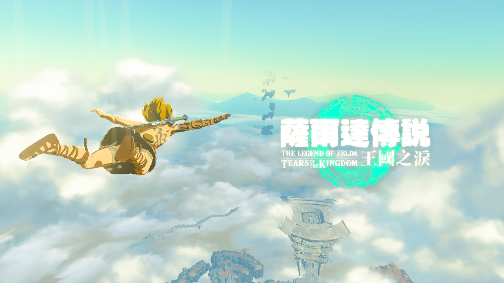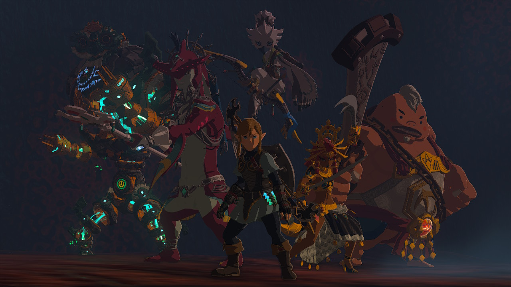

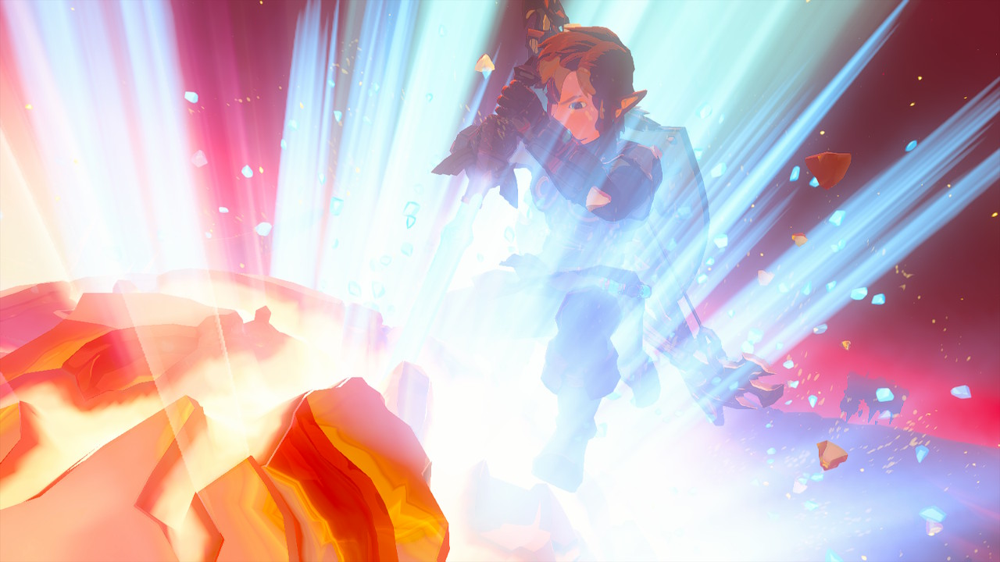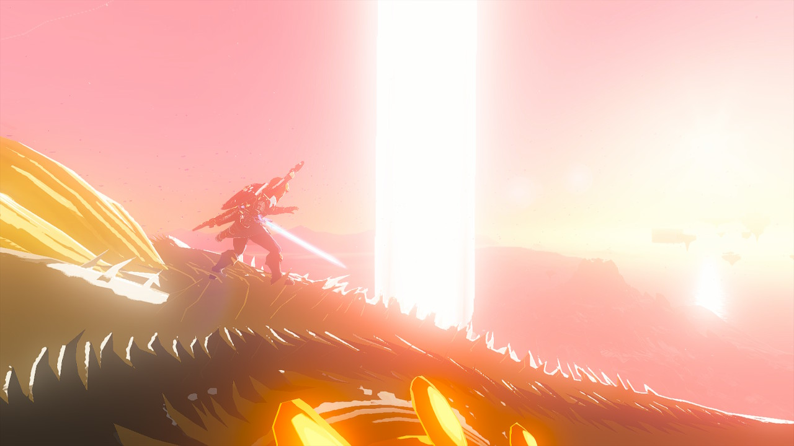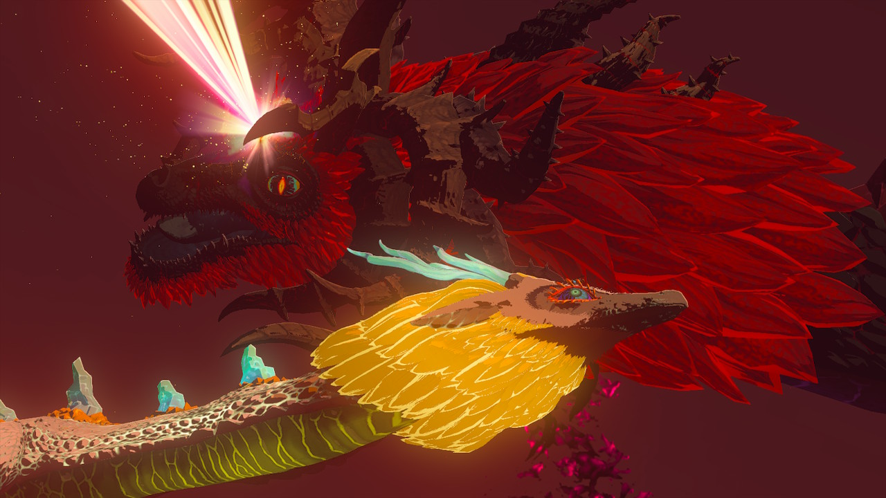

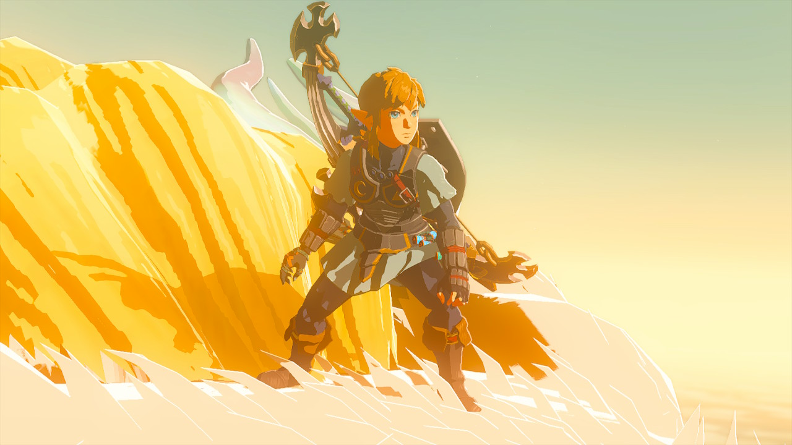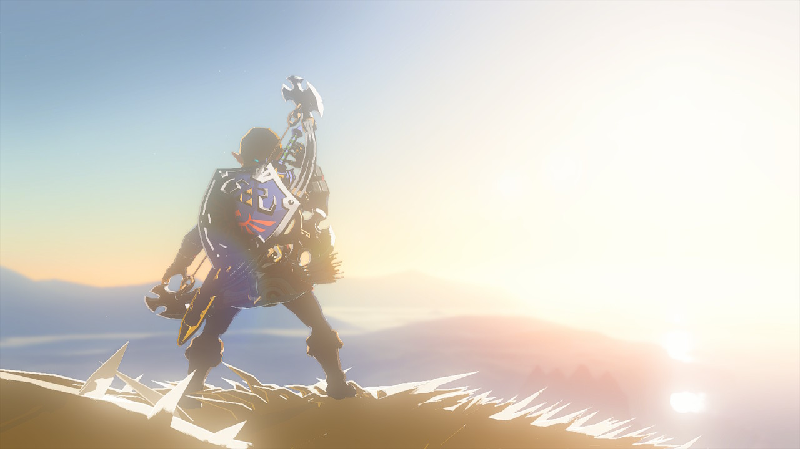

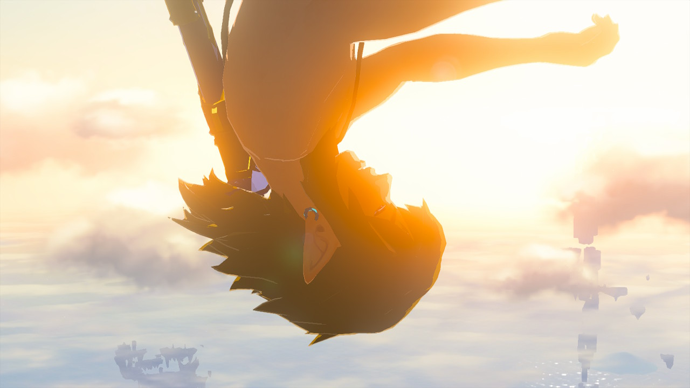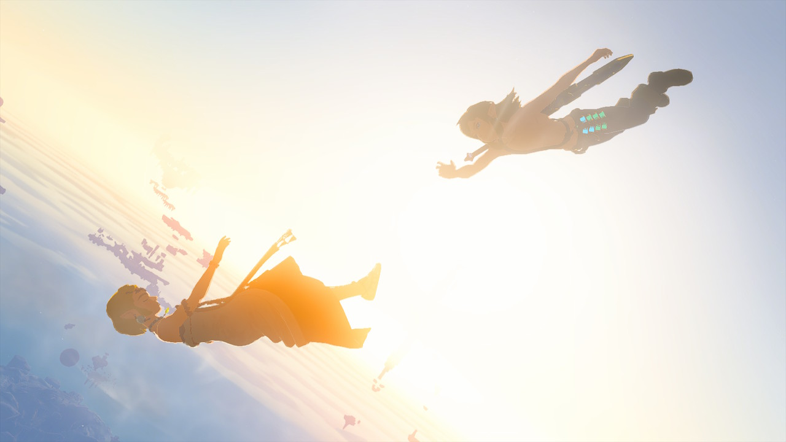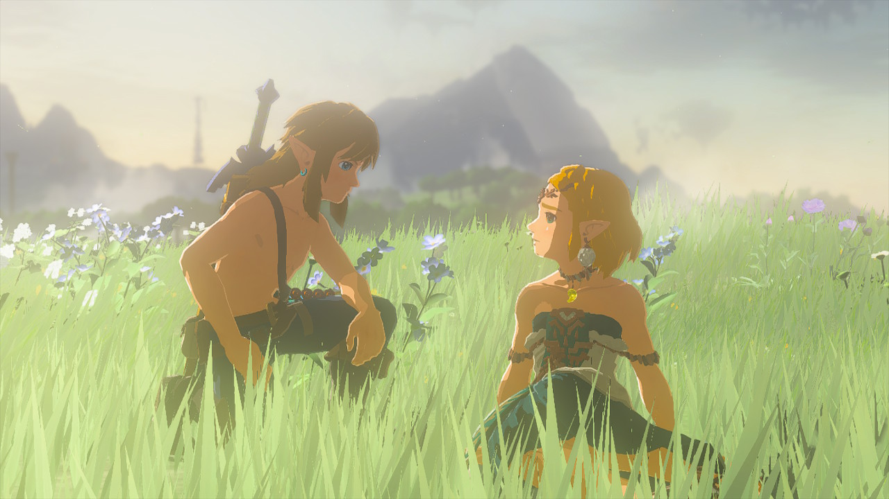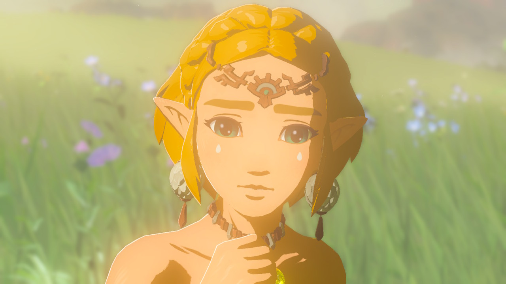

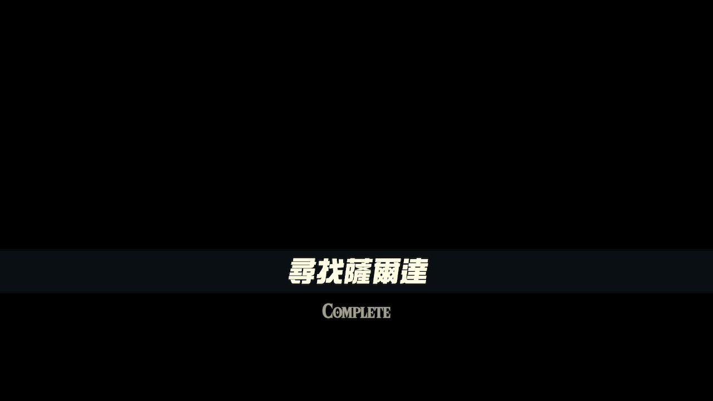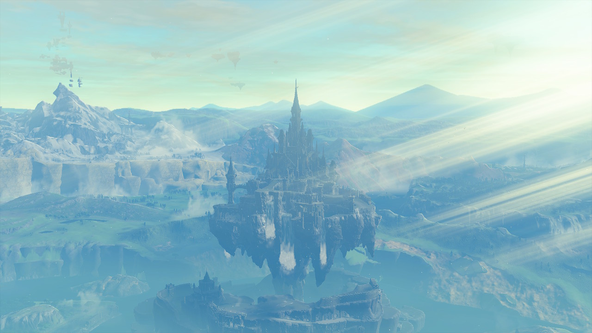